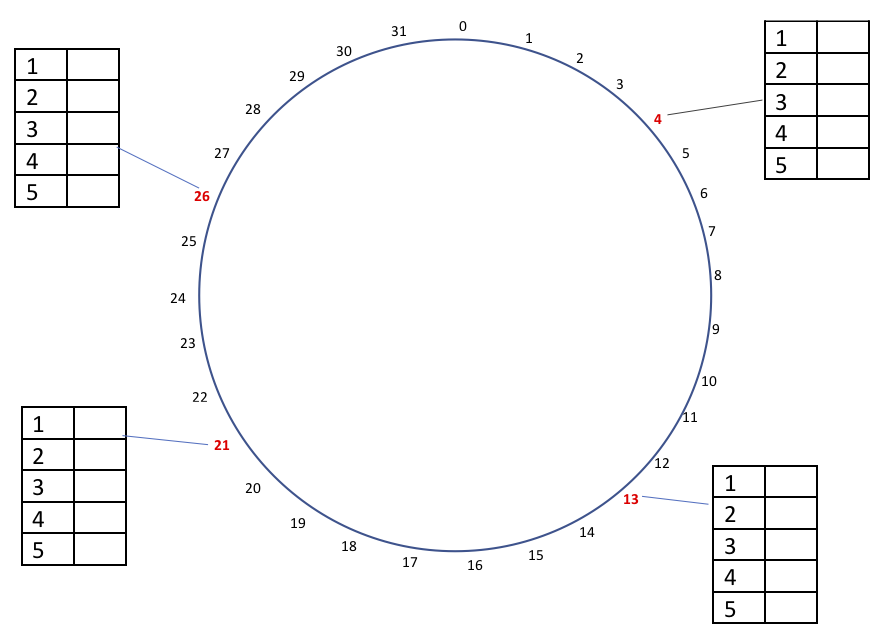
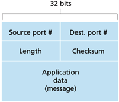
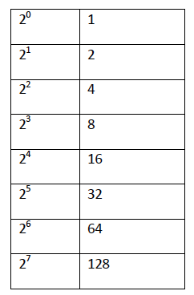
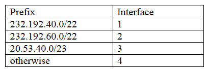

# Distributed System Tasks

## Task 1 - Processes and Communication
**Differentiate between the following:**

#### **a. Persistent and transient communication**
 * Electronic mail system is a typical example of persistent communication.
 * With persistent communication, a message that has been submitted for transmission is stored by communication 
 middleware as long as it takes to deliver it to the receiver. In this case the middleware will store the message at 
 one or several of the storage facilities. It is not a necessity for the sending application to continue execution 
 after submitting the message. Likewise, the receiving application does not need to be executing when the message is 
 submitting.
 * In Transient communication, a message is stored by the communication system while the sending and receiving 
 application are executing. More precisely if the middleware cannot deliver a message due to a interruption during 
 transmission or because the recipient is not currently active, the message will simply be discarded
 
 Communication can as well as beeing persistent and transient, be synchronous and asynchronous.
  
 
#### **b. Synchronous and asynchronous communication**
 * **Asynchronous** communications characteristic features is that a sender continues immediately after it has submitted
 its message for transmission. This means that the message is temporarily stored immediately by the middleware 
 upon submission. 
 * With **Synchronous** communication the sender is blocked until its request is known to be accepted. Essentially there
 are three points where synchronization takes place.
    1. The sender may be blocked until the middleware notifies that it will take over transmission of the request.
    2. the sender may synch until its request has been delivered to the intended recipient. 
    3. synchronization may take the place by letting the sender wait until its request has been fully processed, that is, 
    up to the time that the recipient returns a response.
 
#### **c. Concurrent and Iterative servers**
 * with **Iterative** servers, the server itself handles the request and, if necessary returns a response to the 
 requesting client.
 * **Concurrent** servers does not handle the request itself, but passes it to a separate thread or another process, 
 the immediately starts waiting for the next incoming request. Multithreaded servers are example of concurrent servers.
 Alternate implementation of a concurrent server is to fork a new process for each new incoming request. This approach
 is followed in many Unix systems. The thread or process that handles the request is responsible for returning a 
 response. to the requesting client.
 
#### **d. Stateful and stateless servers**
*  **Stateless** server does not keep information on the state of its clients, and can change its own state without
having to inform any client. Web servers are stateless. It only responds to incoming HTTP requests, which can be either 
for uploading a file to the server or for fetching a file. **Note** that in many stateless designs, the server does 
actually maintain information on tis clients, but crucial is the fact that if this information is lost, it will not lead 
to a disruption of the service offered by the server.
* In contrast, **stateful** servers generally maintains persistent information on its clients. This means that the 
information needs to be explicitly deleted by the server. Typical example is a file server that allows a client to keep 
a local copy of a file, even performing update operations. Such a server would maintain a table containing 
*(client, file)* entries. Such a table allows the server to keep track of which client currently has the update 
permissions on which client currently has the update permissions on which file, and thus possibly also the most recent 
version of that file. This approach can improve the performance of read and write operations as perceived by the client.

#### **e. Multithreaded clients and multithreaded servers** 
* A **Multithreaded client** can be for example be when loading in a web browser where it starts fetching the HTML page 
and subsequently displays it. To hide communication latencies as much as possible, some browser start displaying data
while it's coming in. An example of this is you can see and read the text of a page, but the pictures are not loaded in
yet. So as soon as the main HTML file has been fetched, separate threads can be activated to take care of fetching 
separate files and parts of the page.
* **Multithreaded servers**: The main use of multithreading in distributed systems is found at the server side. Practice 
shows that multithreading simplifies the server code considerable, but also makes it much more easier to develop servers
that exploit parallelism to attain high performance, even on uniprocessor systems.

## Task 2
The figure below shows a chord ring that implements a distributed hash table of m=5bits to provide fault tolerance and 
availability of service. Four servers 4, 13, 21, and 26 (bold and red) are replicated to provide exactly the same 
services to clients. Each server replica maintains five finger table entries.

##### 1.compute the finger table for each replica
**4**
* 1 -> 13
* 2 -> 13
* 3 -> 13
* 4 -> 13
* 5 -> 21

**13**
* 1 -> 21
* 2 -> 21
* 3 -> 21
* 4 -> 26
* 5 -> 4

**21**
* 1 -> 26
* 2 -> 26
* 3 -> 26
* 4 -> 4
* 5 -> 4

**26**
* 1 -> 4
* 2 -> 4
* 3 -> 4
* 4 -> 4
* 5 -> 13
##### 2. what is the address size for this ring
2^5 = 32, size is 5 bits
##### 3. Resolve key = 10 from server replica 26(show your steps)
go from 26 -> 4 because 4 =< 10 < 13. And then 4 -> 13 since 13 is responsible for 10
##### 4. Resolve key = 5 from server replica 4(show your steps)
 directly to 13 since 4 < 5 < 13. this is because 13 is responsible for node 5
##### 5. Which server replicas are responsible for the keys = 0, 4, 15, 16, 24, 26, 30(show the formula used)
4: 0, 4 and 30. 21: 15, 16. 26: 24 and 26

## Task 3

An overlay network is formed by 5 processes to be used to multicast messages as shown in the above figure. Process C is 
at the root of the multicast tree. The delays between the routers for the physical network are given. Use this figure 
to answer the following questions

##### 1. What is the delay in the overlay network when a message is multicast from C to D?
C - Rc - Rb - B - Rb - Ra - A - Re - Rd - D = 1 - 25 - 1 - 1 - 25 - 1 - 1 - 80 - 30 - 1 = 166
##### 2. What is the delay in the overlay network when a message is multicast from C to E?
C - Rc - Rb - B - Rb - Ra - A - Re - Rd - D - Rd - Re = 1 - 25 - 1 - 1 - 25 - 1 - 1 - 80 - 30 - 1 - 1 - 30 - 1 = 198
##### 3. Compute the stretch/relative delay penalty (RDP) when a message is multicast from C to E provided that the best path (least-cost) will be used by the underlying physical routers to route message from C to E
Overlay cost was 198, underlay route is C - Rc - Rd - Re - E = 1 - 10 - 30 - 1 = 42. RDP = 198/42 = 4,7
##### 4. if the tree is modified such that path A -> D is removed and a new path A -> E is created resulting in a new path for the tree as: C -> B -> A -> E -> D. Compute the relative delay penalty to route message from C to E.
C - Rc - Rb - B - Rb - Ra - A - Ra - Re - E = 1 - 25 - 1 - 1 - 25 - 1 - 1 - 80 - 1 = 136. RPD = 136/42 = 3,2
##### 5. Based on your calculations in (3) and (4), which tree would be more efficient to route a message from C to E? Explain your answer.
most efficient would be the new tree as the RDP is much smaller using the overlay. C - E is the only route effected, but
is very effected.

## Task 4
##### 1. Describe the benefits and challenges of replication in a distributed system
It improves performance with having bigger size, it can handle bigger load. And can also cover bigger geographical 
areas. It increases the availability by having copy of data all over the globe instead of just one place. Its increased
scalability helps avoiding bottlenecks on the main server by balancing load between main and replicated servers. 
Scalability problems often treated as a performance problem. Replication and caching improve performance. It's possible 
improve performance by placing copies of data close to the processes using them, this reduces access time. This is a 
trade-off due to the copies requiring more bandwidth to keep up to date.
The reliability of the system is bigger. If a replica crashes, we can switch to another. Servers with non-faulty data 
outvotes those with faulty data. **Price**: Having multiple copies lead to consistency problem. When a copy is modified,
copy becomes different from the rest. To maintain consistency, updates have to be carried out on all copies. this is 
quite costly in terms of performance. There are also read-write conflict and write-write conflicts where operations 
happen concurrently and they can't see what the other part is doing.
##### 2. Differentiate between Remote-write protocols and Local-write protocols
#### **Remote-Write** 
* All write operations are forwarded to the primary replica
* Primary performs the update on its local copy and forwards the update to backup servers
* Backup server performs the update and send acknowledgement to the primary
* Primary sends ack to initial process
* Read operations are carried out locally at each replica

**Remote-Write provides**
* A simple way to implement sequential consistency
* Guarantees that client see the most recent write operations.

 **However, communication overhead is high in Remote-Write protocols**
 * Client blocks until all the replicas are updated
 
 **Remote-Write Protocols are applied to distributed systems that require fault-tolerance**
 * Replicas are mostly placed on the same LAN reduce latency
 * Non-blocking approach is possible - not fault tolerant and read of most recent write is not guaranteed.
 
 #### **Local-Write**
 * All write operations require the primary copy to first be migrated to local replica server
 * Read operations are carried out locally at each replica.
 * Can provide sequential consistency
 
 **Main issue: where is the data item right now?**
 * More time can be used by processes to locate the primary data item first
 
 **Advantage**
 * Multiple successive write operations can be carried out locally while reading simultaneously
 * Possible only if non-blocking protocol is used - updates are propagated to replicas after finishing with local 
 updates.
 
## Task 5
#### 1. Differentiate between lamport clock and vector clock
**Lamport clock**
* Clock synchronization needs to be absolute
* Processes can use the order of occurrence of events rather than absolute time occurrence
* A process increments its counter before each event in that process.
* When a process sends a message, it includes its counter value with the message.
* On receiving a message, the receiver process sets its counter to be greater than the maximum of its own value and the 
received value before it considers the message received

**Vector clock**
* Initially all clocks are set to zero
* Each time a process experiences an internal event, it increments its own logical clock in the vector by one
* Each time a process prepares to send a message, it sends its entire vector along with the message being sent.
* Each time a process receives a message, it increments its own logical clock in the vector by one and updates each 
element in its vector by taking the maximum of the value in its own vector clock and the value in the vector in the 
received message 

**Small example**
Two events a, z

Lamport clock: C(a) < C(z) --> Conclusion: none

Vector clocks: V(a) < V(z) --> Conclusion: a -> ... -> z

Vector clock timestamps tell us about causal event relationships
#### 2. Discuss how distributed algorithm works in mutual exclusion algorithm
When a process wants to enter a critical section it increments its clock and multicast a message to all other processes.
It then waits for reply/permission from every other process. If there are no other process using the mutex section, it 
will reply OK and enters the critical section and gains mutex lock. If another process is using the mutex area, it will 
not reply until it's done. If there are two processes that wants to use the area at the same time they compare their 
logical clocks and the one with the lowest value will get access first.
##### Pros
* Mutual exclusion is guaranteed without deadlock or starvation
    * Everyone agrees on the ordering of the time stamps 
    * Conflict? lower timestamp wins 
* Requires 2.(N -1) messages before a process can enter its critical region 
    * Linear time complexity 
##### Cons
* Has N points of failure(crashes)
* Each process must maintain the group membership list 
    * Including entering, leaving, and crashed processes
* Works best with small groups of processes that never change group memberships 
* All processes are involved in all decisions concerning accessing the shared resource
    * burden on resource-constrained machines
    * Any overloaded process can become a bottleneck
##### Improvements:
* When a request comes in, always sends a reply granting or denying permission.
    * This helps detect dead processes
* Use a majority vote(doesn’t need all processes to agree)
#### 3. Discuss how centralized algorithm works in mutual exclusion algorithm
The central idea is to elect one process as the coordinator.
* A process that wants to access the shared resource sends a request to the coordinator asking for permission to a CS

1. Process P1 asks the coordinator for permission to access a shared resource. Permission is granted.
2. Process P2 then asks permission to access the same resource. The coordinator does not reply.
3. When P1 releases the resource, it tells the coordinator, which then replies to P2.

##### Pros
* guarantees mutex by letting one process at a time into each critical region
* It is fair as requests are granted in the order in which they are received. 
* No process ever waits forever so no starvation.
* Easy to implement so it requires only three messages per use of a critical region(Req, grant, release) => coordinator.
* Used for more general resource allocation rather than just managing critical regions

##### Cons
* The coordinator is a single point of failure, so if it crashes, the entire system may go down.
* If process normally blocks after making a request, they cannot distinguish a dead coordinator from "access denied" 
since in both cases coordinator doesn't reply. 
* In a large system, a single coordinator has to take care of all process(Causing bottlenecks)
 
#### 4. Discuss how token-ring algorithm works in mutual exclusion algorithm
Organize a distributed system as a logical ring. There is one token that'¨s passed along the ring. To enter the critical
section one will need to have the token. If a process get the token and doesn't need it, it just passes it along.

##### Pros
* Only one process has the token at a given time
    * Mutex is guaranteed
    * No starvation
##### Cons
* Token lost
    * Process holding it crashes
    * Message containing token is lost
    * Detecting lost token may be hard(unspotted token != lost token)
    * Crashed nodes can break the ring
* Neighbor crashes
    * Solution: let neighbor acknowledge the receipt of token
    * Every process must maintain the current ring configuration
    
#### 5. Explain briefly how bully election algorithm works
When any process notices the coordinator is no longer responding to requests, it initiates an election. When a process 
hold an election it sends an election message to all other processes with higher id. If no one responds the current 
process wins the election. if one of the higher-ups answer, it takes up the job and the previous' job is done. This 
means the higher-up holds a new election. This continues until the process that holds the election does not receive a 
reply and thus becomes the coordinator. This makes the biggest guy in town always wins.

## Task 6
#### 1. Explain how process resilience can be achieved in distributed system
This can be done by having several identical processes in the same group. This way if one process crashes another can 
take over.
#### 2. Differentiate between flat process group and hierarchical process group and discuss their benefits and drawbacks
**Hierarchical group**
* +Decision making is simple
* -Asymmetrical
* -Single point of failure

There's a coordinator which takes control, but if the coordinator the whole system may go down.

**Flat group**
* +Symmetrical
* +No single point of failure
* -Decision making is complicated(voting)
* -delays and overhead

All processes are treated equally, This means that there is no single point of failure. The main problem is that 
decision making is complicated, which will induce delays.

#### 3. Explain feedback implosion and how to use nonhierarchical feedback control to mitigate it
A process will send out a NACK regarding some missing message. This NACK is sent out to all the group members, and if 
some process also want sto send out a NACK regarding the same message, this NACK will not be sent. This way the sender 
only receives one NACK
#### 4. Discuss briefly the five classes of failures that can occur in RPC systems
1. The client cannot locate the server, so no request can be sent.
2. The client's request to the server is lost, so no response is returned by the server to the waiting client.
3. The server crashes after receiving the request, and the service request is left acknowledged, but undone.
4. The server's reply is lost in its way to the client, the service has completed, but the results never arrive at the 
client.
5. The client crashes after sending its request, and the server sends a reply to a newly restarted client that may not 
be expecting it.
## Task 7
Discuss the cryptography schemes that can be used to provide confidentiality, integrity, authentication, and non-repudiation.
#### Symmetric key cryptography
The same key is used to encrypt and decrypt a message. Symmetric cryptosystems are also referred to as secret-key and 
shared-key systems, because the sender an receiver are required to share the same key, anbd to ensure that protection 
works, this shared key must be kept secret, no one else is allowed to see the key.  

Some popular symmetric key encryption systems include: 
* DES - Data Encryption Standard
* Blowfish
* RC5
* AES - Advanced Encryption Standard

Issues with symmetric key cryptography. The main one is perhaps that the two parties must agree on the secret key in 
advance. Is is also not very scalable since user need many pairs of unique key.
How does one deliver a key to the other party securely? It does not provide non-repudiation.

#### Public key Cryptography
The sender and reciever do not share a secret key. They do however have public keys that are available to anyone. This 
key can be used to encrypt a message and send it to its user. The user can then use its private key, to decrypt the 
message. 

This solves the issue of exchanging keys, as the public key is all that is needed to encrypt a message, but the same key
can not be used to decrypt the message. 

One can however derive a private key using the public key, but this is made very computationally difficult. Some schemes
used to calculate private-public key pairs include:
* Integer-Factorization schemes, difficult to factor large integers(RSA)
* Discrete Logarithm Schemes
* Elliptic curve Schemes

#### Hash Function
A hash function will reduce a message of arbitrary length into a fixed-length output. Hash functions are not means of 
encryption, as they are one-way. They also do not have any keys.

Some popular hash functions include:
* MD4(128 bits)
* MD5(128 bits)
* MD6 (up to 512 bits)
* SHA-1 (160 bits)
* SHA-2(SHA-256 and SHA-512 b)
* SHA-3
* RIPEMD-160

A hash function should ideally be fast. It must be collision resistant, meaning two different messages should not 
produce equal hashes. It should be one-way, meaning one cannot derive the original message from the hash. You should 
also not be able to modify a message without modifying the hash.

#### SSL
Secure sockets layer provides transport layer security to any TCP based application using SSL services.

TLS(Transport Layer Security) is an updated and more secure version of SSL.

In this protocol, when a user wants to make a secure connection to a server. It will send a TLS-hello request, meaning 
that the user is asking the server to establish a secure connection. The server will respond with a public key. The user 
will use this public key to encrypt a message containing a key that can be used for symmetric encryption. The server
will decrypt this message using its private key, and store the key sent by the user. Both parties now have a identical 
key that can be used for symmetrical encryption.

In the TLS the server will also respond to the TLS-hello request with a TLS certificate. This certificate will confirm 
the identity of the server. These certificates are distributed and verified by third parties

## Task 8
Explain the following cloud service models
#### 1. Infrastructure as a service
This is where a vendor provides computing resources to the consumer. Examples of such services includes:
* Amazon Elastic Compute(EC2)
* Google Compute Engine
* Azure VM

This kind of service can provide the compute capabilities when you need them without any upfront investment. It can also
quickly scale to your needs.
#### 2. Platform as a service
This is a cloud service that provides a platform that the consumer can use to build and deploy software.

It is a model in which a third-party provider hosts application development platforms and tools on its own 
infrastructure and makes them available to customers over the internet.

Examples:
* AWS Elastic Beanstalk
* Google App engine
* Heroku

#### 3. Software as a service
A software distribution model in which a third party provider hosts applications and makes them available to customers over the internet.

Examples:
* Google docs
* Netsuit

# Networking task

## Task 1 - Layering and services
1. In which five levels is the TCP/IP stack made out of

* Application
* Transport
* Network
* Link
* Physical link

2. For the following protocols which layer in the stack are they implemented in
* **Domain Name System Protokollen (DNS)** runs in the application layer parallel to the program using it.
* **Internet Control Message Protocol (ICMP)** runs in the network layer
* **Ethernet IEEE 802.3** runs in the physical
* **Dynamic Host Configuration Protocol (DHCP)** runs in application layer.

3. Which levels in the TCP/IP protocol stack is implemented on a router?

Network, Link and Physical. In a host, all five layers are implemented.
4. What is multiplexing and demultiplexing? Give an example of how they are used in the TCP/IP stack?

The job of delivering data in the transport-layer to the correct socket is called demultiplexing. The job of gathering 
data chunks at the source host from different sockets, encapsulating each data chunk with header information(that later 
will be used in demultiplexing) to create segments, and passing the segments to the network layer is called multiplexing

5. What is the difference between a hub and a switch?

A hub will only take an input and provide more than one output, or the other way, and it operates on the physical layer.
A switch on the other hand can redirect the segments to the correct destinations based on header information. so it also
operates on the link layer.

## Task 2 - Transport protocols
Følgende figur viser formatet for de segmenter som utveksles i UDP protokollen.

1. Gjør kort rede for hvilken tjeneste UDP protokollen stiller til rådighet samt funksjonen av feltene: Source port, 
Dest port, Length, Checksum og Application data (som angitt på figuren ovenfor).

The UDP service provides a connectionless service to its applicatons. It's a no-frills service that provides no 
reliability, no flow control, and no congestion control.

**Source port Number**: to support request-reply communication patterns.

**Destination port numbers**: for multiplexing/demultiplexing.

**Length**: specifying total number of bytes(Header + Payload data) of the segments.

**Checksum**: to protect against corruption if not supported b the link layer or router memory error.

2. Anta i det følgende en konfigurasjon av Go-Back-N (GBN) protokollen med vindustørrelse på 3 og hvor de første tre 
datapakker med sekvensnumrene 1, 2, og 3 avsendes. Hvordan vil protokollen reagere hvis alle tre datapakker går tapt?

The sender would have to resend all packages. This would happen even though just one of the packages that was supposed 
to be received doesn't arrive

3. Hva vil skje hvis alle tre datapakker kommer frem og kun acknowledgement på datapakke 3 kommer tilbake?

All the previous packages that has been sent, will be resent. That means packages 1-3

4.	Foreslå et pakkeformat som kan brukes til å implementere GBN protokollen hvis sekvensnumre er 3-bits og data-delen kan være mellom 0 og 127 (27) bits.

first bit can be used to define it the package is a data or ack, for a ack package can the 3 next bits be used for 
sequence numbers. 

for a data package, the three next bits can be used to assign sequence number. The next 7 bits can be used for setting 
the length. The 0-127 bits are assign for each package due to the previous 7 bits.
## Task 3 - Network layer and routing
a. Hvilket 32-bits bitmønster svarer IP adressen 232.192.40.7 til? Tabellen nedenfor med 2 potenser kan være nyttig.

bit patterns are the amount of bits assigned for each "slot"

bit pattern 11101010 11000000 00101000 00000111
  
b. Betrakt CIDR (Class Internet Domain Routing) adresseblokken 232.192.40.0/22. Hvilket intervall av adresser utgjør denne blokken?

Makes up a forwarding table.
Longest prefix matching is used to determine the entry to be used for forwarding (most specific entry is used)
Between interface 1 and 2?

c. Betrakt en router med følgende forwarding tabell:

På hvilket interface vil routeren videresende pakker med følgende destinasjon IP adresser (svarene skal begrunnes):

* 232.192.57.14
* 232.192.42.10
* 20.53.40.7
## Task 4 - Link layer and addressing

## Task 5 - Project work

## Task 6 - Packet-switched networks

## Task 7 - Network layer and routing

## Task 8 - Link Layer and local area networks
